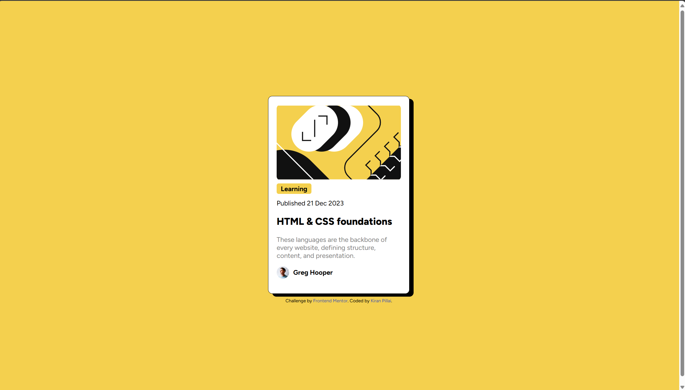
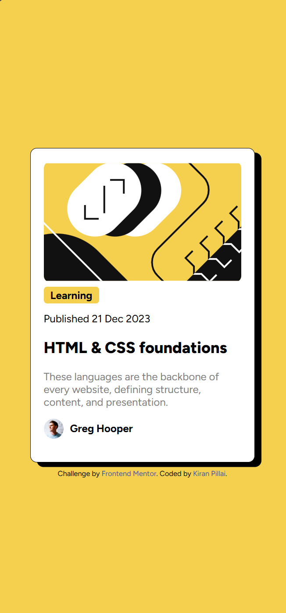

# Frontend Mentor - Blog preview card solution

This is a solution to the [Blog preview card challenge on Frontend Mentor](https://www.frontendmentor.io/challenges/blog-preview-card-ckPaj01IcS). Frontend Mentor challenges help you improve your coding skills by building realistic projects. 

## Table of contents

- [Overview](#overview)
  - [The challenge](#the-challenge)
  - [Screenshot](#screenshot)
  - [Links](#links)
- [My process](#my-process)
  - [Built with](#built-with)
  - [What I learned](#what-i-learned)
  - [Continued development](#continued-development)
  - [Useful resources](#useful-resources)
- [Author](#author)
- [Acknowledgments](#acknowledgments)

## Overview

### The challenge

Users should be able to:

- See hover and focus states for all interactive elements on the page

### Screenshot




### Links

- Solution URL: [Add solution URL here](https://github.com/DetonatedSkull1722/FrontEndMentor-Practise/tree/main/blog-preview-card-main)

## My process

### Built with

- Semantic HTML5 markup
- CSS custom properties
- Flexbox

### What I learned

I am really proud of the transitional and transform property I was able to work with in css because it was totally new to me 

```css
.attribution a {
    color: hsl(228, 45%, 44%);
    text-decoration: none;
}

.attribution a:hover,
.attribution a:focus {
    text-decoration: underline;
}

.main-card:hover {
    transform: translate(-10px,-10px);
    box-shadow: none;
}
```

### Continued development

Honestly I dont think there is much of things to be worried about for continued development. It was supposed to be a simple component and I think I made it pretty well.

## Author

- Website - [Kiran Pillai](https://www.linkedin.com/in/kiran-pillai-492523242/)
- Frontend Mentor - [@DetonatedSkull1722](https://www.frontendmentor.io/profile/DetonatedSkull1722)
