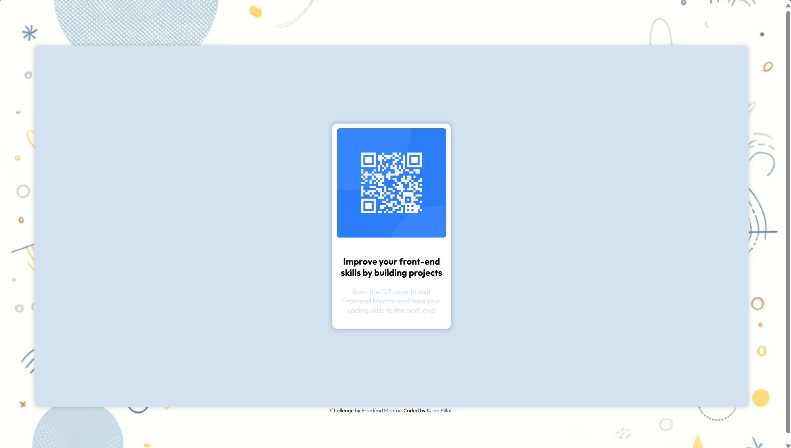

# Frontend Mentor - QR code component solution

This is a solution to the [QR code component challenge on Frontend Mentor](https://www.frontendmentor.io/challenges/qr-code-component-iux_sIO_H). Frontend Mentor challenges help you improve your coding skills by building realistic projects. 

## Table of contents

- [Overview](#overview)
  - [Screenshot](#screenshot)
  - [Links](#links)
- [My process](#my-process)
  - [Built with](#built-with)
  - [What I learned](#what-i-learned)
  - [Continued development](#continued-development)
  - [Useful resources](#useful-resources)
- [Author](#author)

## Overview

### Screenshot

These are the two renders as requested in the challenge
Although media-queries have been set up to work with multiple challenges

### Links

- Solution URL: [Add solution URL here](https://your-solution-url.com)
- Live Site URL: [Add live site URL here](https://your-live-site-url.com)

## My process

  I am very new to webdev so this is my first challenge on frontend-mentor 
  I have made 4 containers which i think i could have removed if centering a div was easy :)
  But these containers are set up correctly to work with the centering of the website and the responsiveness of the elements inside.

### Built with

- Semantic HTML5 markup
- CSS custom properties
- Flexbox

### What I learned

  1. I learnt how to work with box-shadows to provide a fake 3d effect
  2. I revised a lot of concepts that i had learnt before with my courses
  3. I got to learn important media query adjustments that i had forgotten
  4. I used chatgpt on the side to debug my code and breaking of the website (added skill :) ).

### Continued development

  1. Reduce the number of containers used as i think if any changes made might breakt he website to some extent that might make it hard to work with 
  2. Transitional effects while screen size is changing 

### Useful resources
  1. udemy courses by Dr. Angela Yu.

## Author

- Website - [Kiran Pillai](https://www.linkedin.com/in/kiran-pillai-492523242/)
- Frontend Mentor - [@DetonatedSkull1722](https://www.frontendmentor.io/profile/DetonatedSkull1722)
