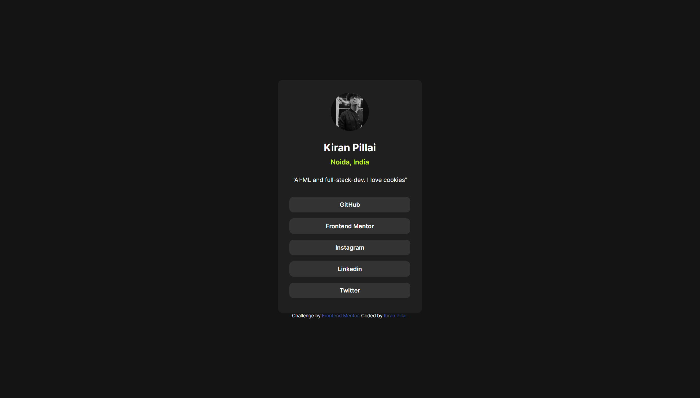
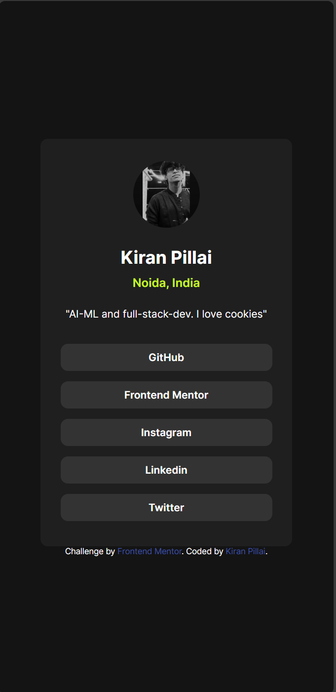

# Frontend Mentor - Social links profile solution

This is a solution to the [Social links profile challenge on Frontend Mentor](https://www.frontendmentor.io/challenges/social-links-profile-UG32l9m6dQ). Frontend Mentor challenges help you improve your coding skills by building realistic projects. 

## Table of contents

- [Overview](#overview)
  - [The challenge](#the-challenge)
  - [Screenshot](#screenshot)
  - [Links](#links)
- [My process](#my-process)
  - [Built with](#built-with)
  - [What I learned](#what-i-learned)
  - [Continued development](#continued-development)
- [Author](#author)

**Note: Delete this note and update the table of contents based on what sections you keep.**

## Overview

### The challenge

Users should be able to:

- See hover and focus states for all interactive elements on the page

### Screenshot

### Links

- Solution URL: [Here is my solution](https://github.com/DetonatedSkull1722/FrontEndMentor-Practise/tree/main/social-links-profile-main/social-links-profile-main)
- Live Site URL: [Vercel deployed](https://front-end-mentor-practise.vercel.app/)

## My process

### Built with

- Semantic HTML5 markup
- CSS custom properties
- Flexbox

### What I learned

I learnt how to apply my previous learnings from the other two projects I did (components only) to this webpage. I was able to play around with margins and other components to match the exact style but keeping my own social media links to this site

### Continued development

I feel like there can be more to this page like i could improvise on the colour patterns rather than the given one.

## Author

- Website - [Kiran Pillai](https://www.your-site.com)
- Frontend Mentor - [@Detonatedskull1722](https://www.frontendmentor.io/profile/Detonatedskull1722)

